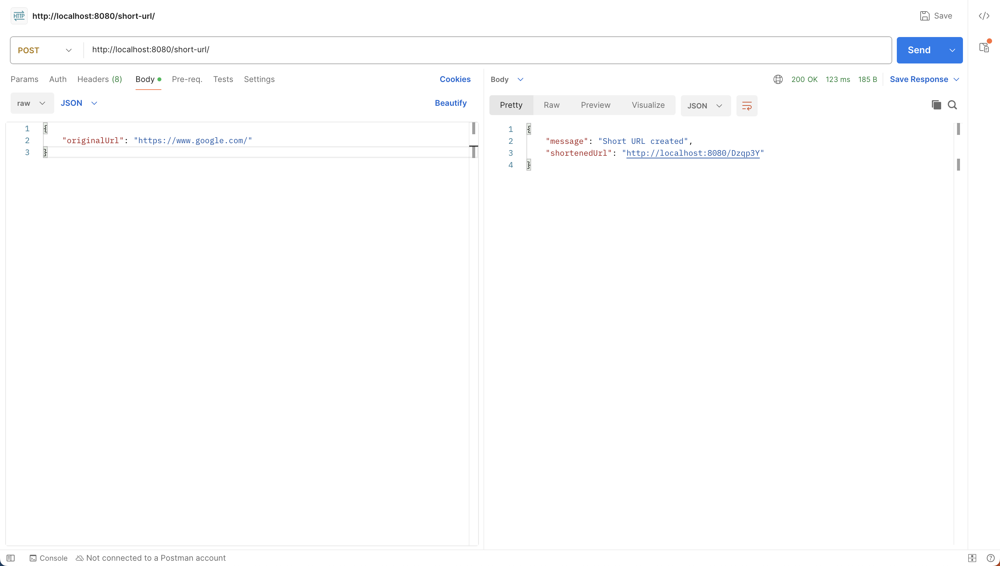
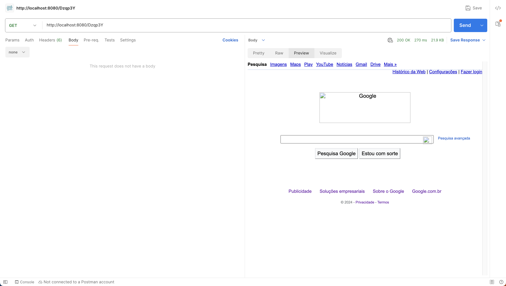

## Short Spot

Short Spot is a URL shortening service that allows users to shorten long URLs into short, easy-to-remember links.

## Features

#### Backend
- Shorten long URLs into short links:
  
- Redirect short links to the original URLs:
  

#### Frontend
WIP

## How to run
```bash
git clone git@github.com:vit0rr/short-spot.git
```

```bash
cd short-spot
```

```bash
go mod tidy
```

```bash
docker compose up
```

```bash
go run cmd/api/main.go 
# or configure your GoPath and run
```